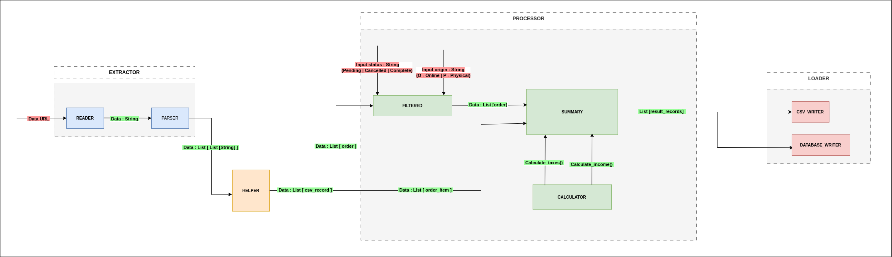

## 🚀 OCamlETL

Data processing project built using OCaml. It focuses on efficiently **E**xtracting, **T**ransforming, and **L**oading data.


> [!NOTE] 
> 
> * **E**xtract : Collect data from various sources 
> * **T**ransform Clean and organize the data according to business rules 
> * **L**oad : Store the data in a destination data store

> [!IMPORTANT]  
> Data repository : https://github.com/leticiacb1/ETL-FunctionalProgramming-Data

<br>



<br>

Read the detailed project report [here](https://github.com/leticiacb1/ETL-FunctionalProgramming/blob/main/Report/report.pdf).

### 📌 Description

As data input, we consume two tables. One stores **order** information and the other stores **product information in those orders**. 

| id  | client_id | order_date           | status   | origin |
|-----|-----------|----------------------|----------|--------|
| 1   | 112       | 2024-10-02T03:05:39  | Pending  | P      |
| 2   | 117       | 2024-08-17T03:05:39  | Complete | O      |
| 3   | 120       | 2024-09-10T03:05:39  | Cancelled| O      |

| order_id | product_id | quantity | price  | tax  |
|----------|------------|----------|--------|------|
| 12       | 224        | 8        | 139.42 | 0.12 |
| 13       | 213        | 1        | 160.6  | 0.16 |
| 2        | 203        | 7        | 110.37 | 0.15 |


The goal of the project is to **aggregate information related to the total amount paid and the total taxes** for each order. 

The return should be **filtered** according to the **order status (Pending | Cancelled | Complete)** and the desired **store type (O - Online | P - Physical)**.


| **Order ID** | **Total Amount** | **Total Taxes** | **Date**               | **Status** | **Origin** |
|--------------|------------------|-----------------|------------------------|------------|------------|
| 4            | 3086.71          | 422.5537        | 2024-03-11T03:05:39    | Pending    | O          |
| 6            | 1757.79          | 249.7358        | 2024-04-18T03:05:39    | Pending    | O          |
| 9            | 785.2            | 109.928         | 2025-01-08T03:05:39    | Pending    | O          |       

### ⚙️ Requirements

#### **1. Ocaml**
```bash
$ sudo apt-get install opam
$ ocaml --version
  The OCaml toplevel, version 4.14.1

$ opam init -y
$ opam install ocaml-lsp-server odoc ocamlformat utop
$ eval $(opam env) # Update the current shell environment
```
To check the installation, start the _UTop_ :

```bash
$ utop
# 21 * 2;;
# Ctrl + D 
```
See more, [here](https://ocaml.org/docs/installing-ocaml).

#### 2. Dune 

```bash
   # Install
   $ opam install dune
   $ dune --version
     3.17.2

   # Init project
   $ dune init proj project_name

   # Build project
   $ cd project_name
   $ dune build

   # Run tests
   $ cd project_name
   $ dune test

    # Execute project
   $ cd project_name
   $ dune exec project_name
```

See more, [here](https://dune.build/).


#### 3. Libraries

```bash
# Activate env
$ eval $(opam env) 

# Install
$ opam install cohttp cohttp-lwt cohttp-lwt-unix \
               csv \
               lwt lwt_ssl \
               sqlite3 \
               ounit2
```

### 🐫 How to use

Overview project information ate in file `ETL/dune-project`, with required dependencies.

#### 1. Make sure you have all the necessary libraries and tools

```bash 
$ ocaml --version
  The OCaml toplevel, version 4.14.1

$ dune --version
     3.17.2

$ opam list | grep cohttp cohttp-lwt cohttp-lwt-unix \
               csv \
               lwt lwt_ssl \
               sqlite3 \
               ounit2

```

#### 2. Run

```bash
# Change directory
$ cd ETL/

# Build
$ dune clean && dune build 

# Execute
$ dune exec main
```

#### 3. Tests

```bash
# Change directory
$ cd ETL/

# Build
$ dune clean && dune build 

# Run tests
$ dune runtest
```

See more, [here](https://dune.readthedocs.io/en/stable/quick-start.html).

#### 4. Outputs

Inside `Data/generated/` there will be two generated files, a **agg_order.csv** and a **agg_order.db** with the calculated result.

##### SQLite3

Checking `agg_order.db` file :

```bash
# Install
$ sudo apt install sqlite3

# Inside SQLite prompt
$ sqlite3 ../Data/agg_order.db
  
  sqlite> .tables
  sqlite> SELECT * FROM results;
  sqlite> .exit
```

<br>

<div align="center">
  
**@2025, Insper**. 10° Semester, Computer Engineering.

_Funcional Programming Discipline_
  
</div>
